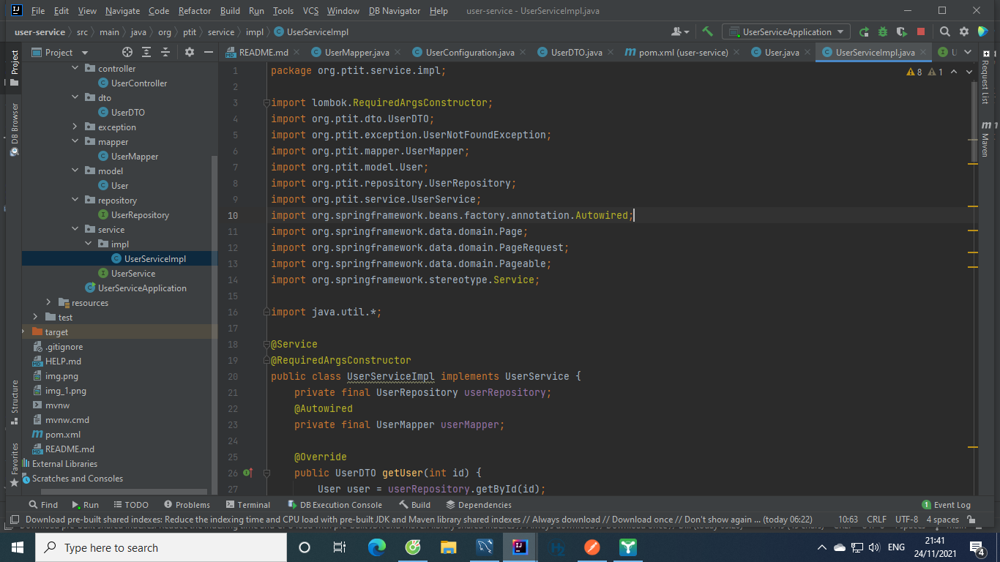

#Tổng quan về project:
- Trong project này tôi  triển khai Spring Boot với API hỗ trợ thêm,sửa,xóa, phân trang và lọc .
- Ở đây tôi đang dùng Pageable trong Spring Data Core,Spring Data JPA với cơ sở dữ liệu dựa trên MySQL trong quá trình phát triển 
- Công nghệ sử dụng:
  + Java 17
  + Spring Boot 2.6.0
  + JPA
  + MySQL
  + LomBok
  + Maven
  + ModelMapper
  + Liquibase
  + IntelliJ Idea for IDE
#Mô tả cụ thể:
  - Project có thực thể User chứa các thuộc tính:
    + id dùng để phân biệt các đối tượng user
    + name để lưu tên user
    + idNumber để lưu cccd của user
    + age để lưu tuổi của user
    + address để lưu địa chỉ ( tên tỉnh) của user
    Nó có dạng như sau:
    
    Ở đây tôi có dùng thêm các chú thích của Lombok :
    + @Data cung cấp các phương thức getter,setter,constructor bắt buộc,equals,hashcode,toString
    + @AllArgsConstructor,@NoArgsConstructor cung cấp constructor có tất cả các đối, và constructor không đối
    Ngoài ra còn 1 số chú thích cơ bản như @Entity để đánh dấu class là 1 thự thể ,@Table để xác định tên table , @Id để xác định khóa chính,
    @GeneratedValue để cấp id tự động và @Column để xác định tên và các tính chất cho cột
  - Kho lưu trữ hỗ trợ phân trang, query data và bộ lọc : 
    
    + Ở đây Repository  cho phép chúng tôi có thể phân trang bằng phương thức findAll mà không cần thực hiện bất kỳ triển khai tùy chỉnh nào và nó phản hồi với Page <T> bao gồm tất cả các giá trị mà tôi cần có trong API của mình.
    + Để xác định SQL thực thi cho một phương thức kho lưu trữ dữ liệu Spring Boot ta dùng @Query đọc thêm tại "https://www.baeldung.com/spring-data-jpa-query"
  - Lớp service chứa các chức năng người dùng:
    
    (xem thêm tại UserServiceImpl)
  - Bao gồm các chức năng: 
    + getUser: lấy user theo id và trả về cho lớp Controller
    + addUser: thêm user theo và trả về cho lớp Controller
    + updateUser: sửa thông tin user theo id và trả về cho lớp Controller
    + updateUserByIdNumber: sửa thông tin cccd của user và trả về cho lớp Controller
    + deleteUserById: xóa user theo id
    + deleteUsers: xóa tất cả user
    + getUsers: lấy user và phân trang
    + findUserByAge: lấy user và phân trang có lọc theo tuổi
    + searchUserByName(lọc theo tuổi và theo địa chỉ)
    Các phương thức có chưa phân trang  bao gồm
    + Một  đối tượng  Pageable với page& size.
    + 1 đối tượng Map để lưu list user và các thông số của trang như :currentPage,totalItems,totalPages
    + Các phương thức Page<> đều trả về một  đối tượng Page. Để lấy các thông số ta gọi:
      * getContent() để truy xuất Danh sách các mục trong trang. 
      * getNumber() cho Trang hiện tại. 
      * getTotalElements() cho tổng số mục được lưu trữ trong cơ sở dữ liệu. 
      * getTotalPages() cho tổng số trang.
  - Các API nhận request :
    
    + Trong các URL yêu cầu HTTP, các tham số phân trang là tùy chọn. Vì vậy, nếu Rest API  hỗ trợ phân trang phía máy chủ, thì nên cung cấp các giá trị mặc định để phân trang hoạt động ngay cả khi người dùng không chỉ định các tham số này.
    + Đoạn mã trên chấp nhận các thông số phân trang sử dụng @RequestParam chú thích cho page, size. Theo mặc định,user sẽ được tìm nạp từ cơ sở dữ liệu trong chỉ mục trang 0.
  - Link postmam test : https://go.postman.co/workspace/My-Workspace~95693807-e657-4cab-8987-2a4c5af1cd31/collection/16170323-ed5df614-fbf3-42c1-bb3b-3a527c9a9889

