#Tổng quan về project:
1. Project này được xây dựng để triển khai các thao tác cơ bản của client đối với một user bao gồm: thêm ,sửa, sửa cccd của user, xóa user, lấy user, lấy user có phân trang, lấy user theo tuổi có phân trang và tìm kiếm user theo tên ( lọc theo địa chỉ và tuổi)
2. Công nghệ sử dụng:
   - Java 17
   - Spring Boot 2.6.0
   - JPA
   - MySQL
   - LomBok
   - Maven
   - ModelMapper
   - Liquibase
   - IntelliJ Idea for IDE
#Mô tả cụ thể:
>Project có:
   
1. Thực thể User chứa các thuộc tính:
    + id dùng để phân biệt các đối tượng user
    + name để lưu tên user
    + idNumber để lưu cccd của user
    + age để lưu tuổi của user
    + address để lưu địa chỉ ( tên tỉnh) của user
      * Nó có dạng như sau:
       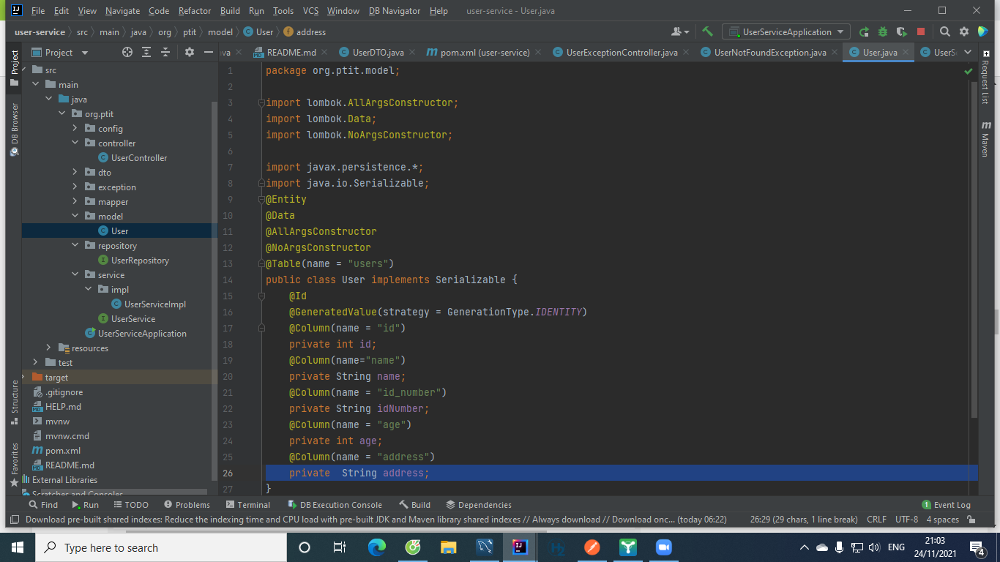
    - Ở đây tôi có dùng thêm các chú thích của Lombok :
      + @Data cung cấp các phương thức getter,setter,constructor bắt buộc,equals,hashcode,toString
      + @AllArgsConstructor,@NoArgsConstructor cung cấp constructor có tất cả các đối, và constructor không đối
    - Ngoài ra còn 1 số chú thích cơ bản như @Entity để đánh dấu class là 1 thự thể ,@Table để xác định tên table , @Id để xác định khóa chính, @GeneratedValue để cấp id tự động và @Column để xác định tên và các tính chất cho cột
2. Kho lưu trữ hỗ trợ phân trang,tìm kiếm và bộ lọc : 
    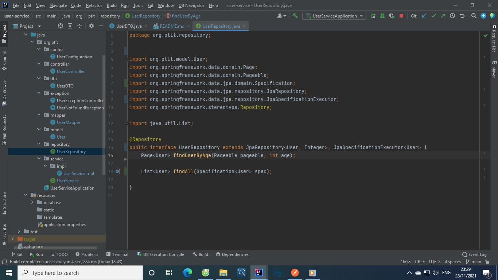
    + Ở đây Repository cho phép có thể phân trang bằng phương thức findAll mà không cần thực hiện bất kỳ triển khai tùy chỉnh nào và nó phản hồi với Page <T> bao gồm tất cả các giá trị mà tôi cần có trong API của mình.
    + Chúng ta cũng có thể tự định nghĩa phương thức phân trang có bộ lọc như phương thức :
      >`Page<User> findUserByAge(Pageable pageable, int age); `
      * Phương thức này sẽ trả về 1 Page bao gồm tất cả các giá trị mà chúng ta yêu cầu và đã được lọc  theo age 
    + Khi ta mở rộng JpaSpecificationExecutor ta sẽ được cung cấp 3 phương thức để thực thi Specifications:
      * `List<T> findAll(Specification<T> spec);

      * Page<T> findAll(Specification<T> spec, Pageable pageable);

      * List<T> findAll(Specification<T> spec, Sort sort);`
3. Khi thực hiện 1 request nếu dùng lớp User để trả về dữ liệu người dùng thì có trường id sẽ là không cần thiết và trong 1 số trường hợp client mong muốn trả về 1 trường nào đó bất kì ta có thể định nghĩa lớp UserDTO để trả về đúng dữ liệu mà client mong muốn. Làm như vậy ta sẽ tăng được hiệu suất của chương trình và hạn chế dữ liệu dư thừa. Lớp UserDTO :
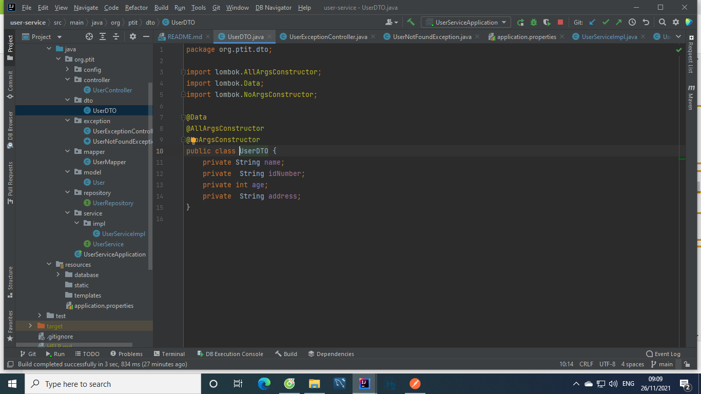
4. Lớp UserMapper để Mapping dữ liệu tự động thay vì phải code tay:
   >`public User convertToEntity(UserDTO userDTO){
      User user1=new User();
      user1.setName(userDTO.getName());
      user1.setIdNumber(userDTO.getIdNumber());
      user1.setAge(userDTO.getAge());
      user1.setAddress(userDTO.getAddress());
      return user1;
      }`
    - Đây là phương pháp thủ công và khi thực thể có nhiều thuộc tính phải thao tác thì sẽ rất mất thời gian . Khi đó ta có thể dùng ModelMapper để làm điều này. Chúng ta chỉ cần :
   >`public User convertToEntity(UserDTO userDTO){
      User user=modelMapper.map(userDTO,User.class);
      return user;
      }`
    - ModelMapper sẽ hỗ trợ cho chúng ta việc chuyển đổi dữ liệu sao cho phù hợp với map().
    - Ở đây tôi cũng sử dụng map() để chuyển đổi kiểu dữ liệu của 2 Page:
   >`public <T, H> Page<T> mapPage(Page<H> inputData, Class<T> clazz) {
      return inputData.map(i -> modelMapper.map(i, clazz));
      }
      `
    - Để thuận tiện hơn trong việc mapping 1 list tôi có định nghĩa method mapList:
   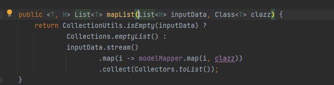
    - Tổng quan lại lớp mapping có:
    - 
    - Note: Để sử dụng DI chúng ta thêm @Component 
5. Lớp interface service chứa các chức năng người dùng:
   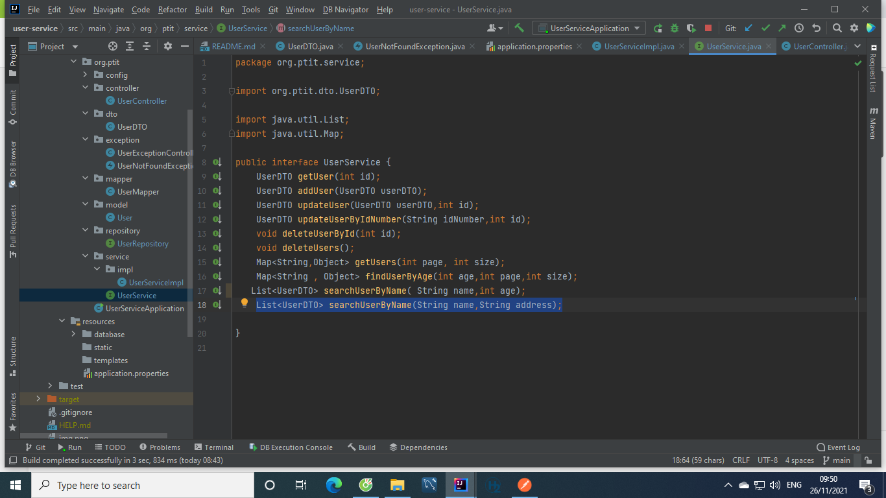
    (xem thêm tại UserServiceImpl)
  - Bao gồm các chức năng: 
    + getUser: lấy user theo id và trả về cho lớp Controller
    + addUser: thêm user theo và trả về cho lớp Controller
    + updateUser: sửa thông tin user theo id và trả về cho lớp Controller
    + updateUserByIdNumber: sửa thông tin cccd của user và trả về cho lớp Controller
    + deleteUserById: xóa user theo id
    + deleteUsers: xóa tất cả user
    + getUsers: lấy user và phân trang
    + findUserByAge: lấy user và phân trang có lọc theo tuổi
    + searchUserByName(lọc theo tuổi và lọc theo địa chỉ)
6. Lớp Service Implement chức năng:
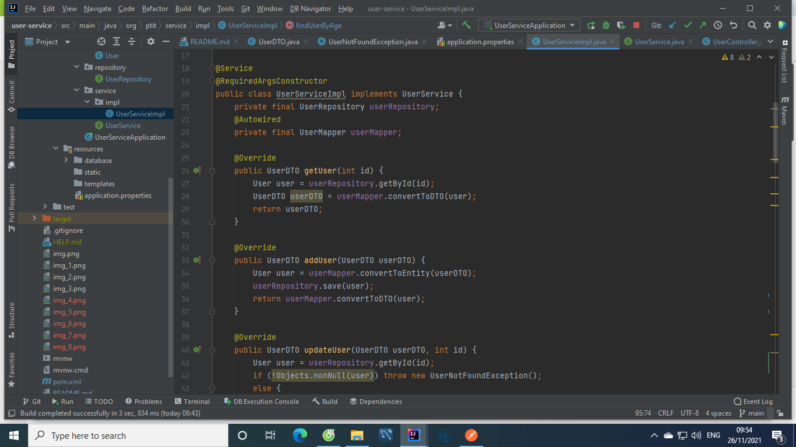
   I. Các phương thức phân trang  bao gồm:
    + Một  đối tượng  Pageable với page& size.
    + 1 đối tượng Map để lưu list user và các thông số của trang như :currentPage,totalItems,totalPages
    + Các phương thức Page<> đều trả về một  đối tượng Page. Để lấy các thông số ta gọi:
        * getContent() để truy xuất Danh sách các mục trong trang.
        * getNumber() cho Trang hiện tại.
        * getTotalElements() cho tổng số mục được lưu trữ trong cơ sở dữ liệu.
        * getTotalPages() cho tổng số trang.
    - Các Phương thức  Specification cho phép chúng ta lấy ra dữ liệu từ database theo yêu cầu
    - Để thực hiện các chức năng ta cần khai báo :
   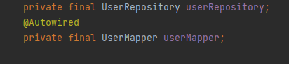
   
II. Đi sâu vào các chức năng :
    
- UserDTO getUser(int id):
      + Method này có chức năng lấy 1 user theo id bằng cách truyền 1 id vào để thực hiện  và nó có dạng 
      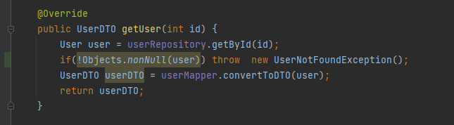
      + Để có thể get được user gọi `userRepository.getById(id)` sau đó gán nó cho 1  biến user kiểm tra xem nếu nó null thì ném ra ngoại lệ còn nếu không null thì mapping nó thành UserDTO:`userMapper.convertToDTO(user)` Sau đó trả về 1 DTO
- UserDTO addUser(UserDTO userDTO):
  + Để thêm 1 user ta truyền vào 1 đối tượng mang dữ liệu cần thiết :
  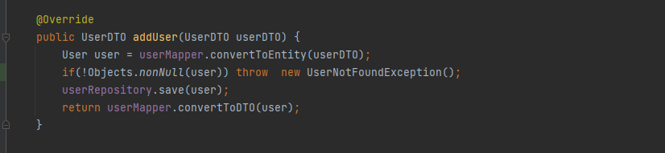
  + Mapping đối tượng thành user.Nếu đối tượng đó k null thì chúng ta sẽ lưu nó vào kho lưu trữ bằng cách `userRepository.save(user);` và sau đó trả về nó
- UserDTO updateUser(UserDTO userDTO,int id):
    + Để sửa thông tin 1 user ta truyển cho nó 1 đối tượng chứa thông tin cần sửa và 1 id để tìm user trong repository:
    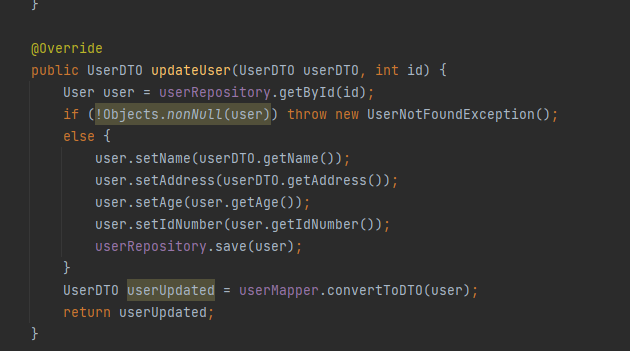
    + Quy trình: lấy user theo id nếu id null thì ném ra ngoại lệ, nếu không thì set các trường cho user theo đối tượng được truyền vào , lưu nó sau khi set convert sang kiểu DTO và trả về nó
- UserDTO updateUserByIdNumber(String idNumber,int id): 
    + Tương tự updateUser chỉ khác chỗ set idNumber:
     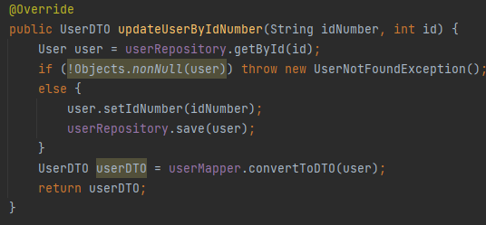
- void deleteUserById(int id):
    + Xóa 1 user theo id:
    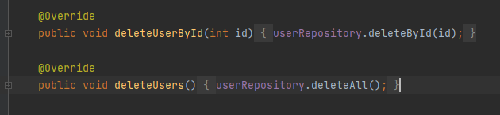
- void deleteUsers();
    + Xóa tất cả user:
    
- Map<String,Object> getUsers(int page, int size);
    + Lấy danh sách user có phân trang:
    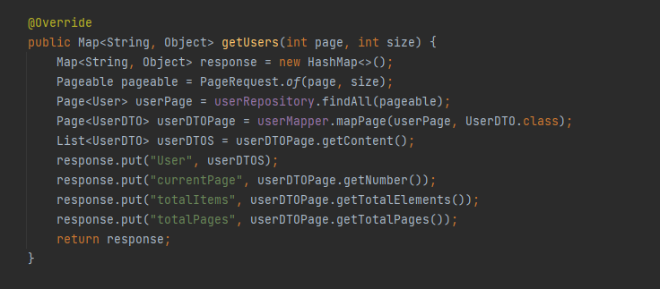
    + Đầu tiên ta tạo Pageable có chứa các thông tin về trang bạn yêu cầu như kích thước và số lượng trang. Và ta triển khai nó bằng cách dùng  PageRequest:
    >`Pageable pageable = PageRequest.of(page, size);`
    + Sau đó gọi 1 Page truyền vào nó 1 Pageable để nhận về 1 Page theo yêu cầu:
    >` Page<User> userPage = userRepository.findAll(pageable);`
    + Ở đây tôi có sử dụng mapPage để chuyển page từ kiểu entity sang DTO:
    >` Page<UserDTO> userDTOPage = userMapper.mapPage(userPage, UserDTO.class);`
    + Để nhận về danh sách đối tượng từ page ta dùng getContent():
    >`List<UserDTO> userDTOS = userDTOPage.getContent();`
    + Để có thể trả về được số lượng page, số lượng user , số page, và tất cả các user ta dùng 1 Map:
    >`Map<String, Object> response = new HashMap<>();
       response.put("User", userDTOS);
       response.put("currentPage", userDTOPage.getNumber());
       response.put("totalItems", userDTOPage.getTotalElements());
       response.put("totalPages", userDTOPage.getTotalPages());`
- Map<String , Object> findUserByAge(int age,int page,int size):
    + Tương tự phân trang và lọc với tuổi:
    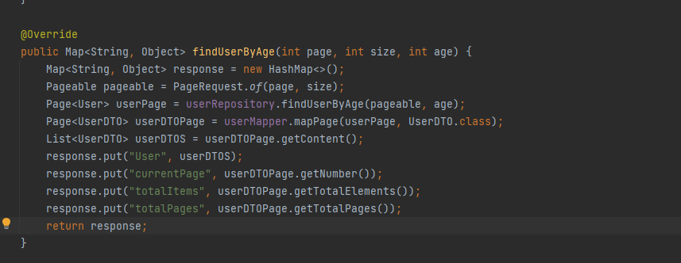
- List<UserDTO>searchUserByName(String name, String address, Integer age):
    + Để có thể tìm kiếm user theo tên hoặc 1 keyword và lọc theo tuổi và địa chỉ ta sử dụng Specification:
    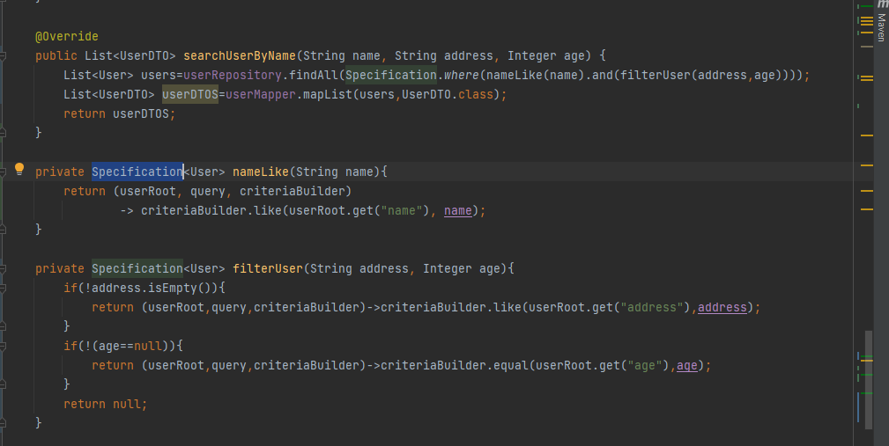
    + Method Specification chứa các Criteria API Query để thực hiện các query theo yêu cầu
    + Để thuận tiện cho việc query và tránh sự phụ thuộc tôi định nghĩa 2 phương thức nameLike và fillterUser
    + Specification<User> nameLike(String name): dùng để lấy ra danh sách user có tên theo yêu cầu
    + Specification<User> filterUser(String address, Integer age): dùng để lấy ra danh sách các user có address hoặc địa chỉ theo yêu cầu.

III. Các API của project
 - URL project: localhost://8081/api/v1/users
1. GET
   - getUser:
        + URL :localhost://8081/api/v1/users/{id}
        + Với API này tham số được truyền vào dưới dạng Path Variable
        + API nhận id trả về user theo id và HTTP status code 200 nếu thành công:
          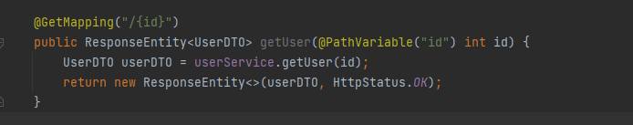
        + Test URL bằng Postman với id=20 ta có:
          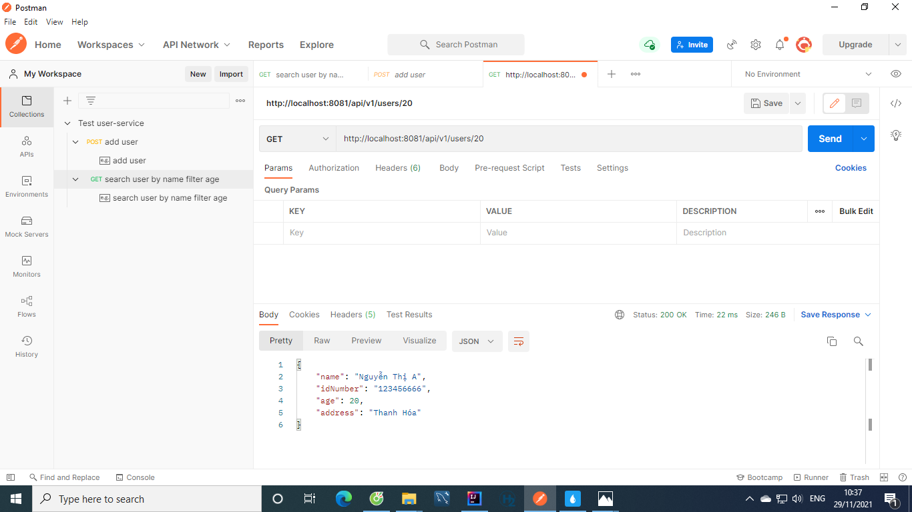
   - getUsersPage:
        + URL: localhost://8081/api/v1/users
        + API nhận tham số page và size dưới dạng Param và trả về 1 map chứa số lượng user, list user, số trang, số lượng trang theo yêu cầu kèm theo đó là HTTP status code 200 nếu thành công. 
        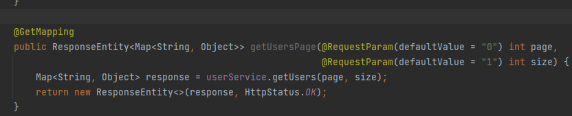
        + Nếu không truyền tham số thì tham số sẽ ở dạng mặc định page=0 và size=1
        + Test API bằng Postman với tham số mặc định:
        
        + Test API bằng Postman với tham số tùy ý: Ở đây tôi truyền page=1 and size=10
        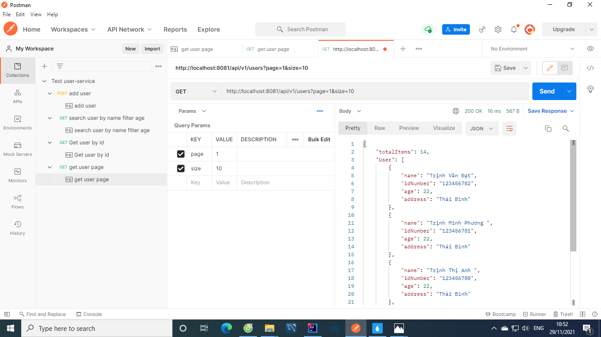
   - getUsersPageFilterAge:
        + URL: localhost://8081/api/v1/users/age
        + API nhận tham số là page,size và age dưới dạng Param và trả về 1 map chứa số lượng user, list user, số trang, số lượng trang theo yêu cầu kèm theo đó là HTTP status code 200 nếu thành công.Nếu age khác null thì list user được trả về sẽ là list user đã được lọc theo độ tuổi
        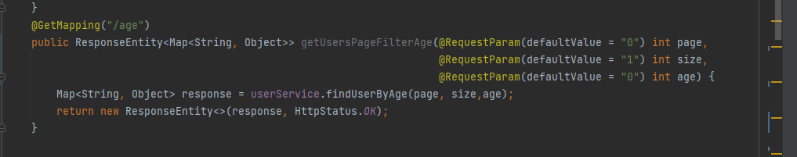
        + Mặc định age=0,page=0,size=1
        + Test API bằng Postman với tham số mặc định:
        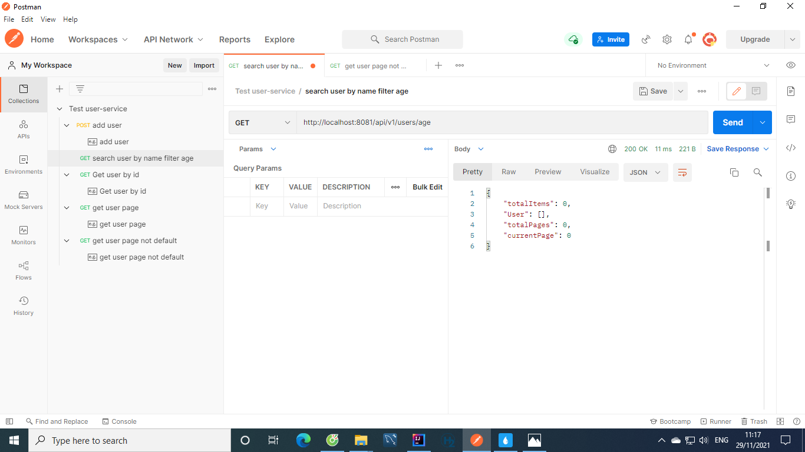
        + Test API bằng Postman với tham số page=0, size=5,age=20:
        
   - searchUserByName:
      + URL: localhost://8081/api/v1/users/search
      + API nhận tham số là name, address, age dưới dạng Param và trả về 1 list user theo yêu cầu cùng HTTP status code 200 sau khi thực hiện thành công
      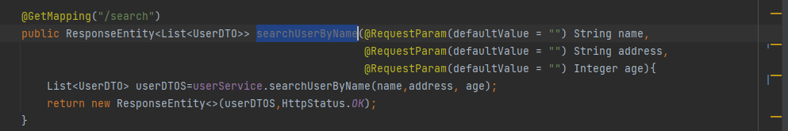
      + Mặc định tất cả các tham số đều là null
      + Test API bằng Postman với tham số mặc định:
      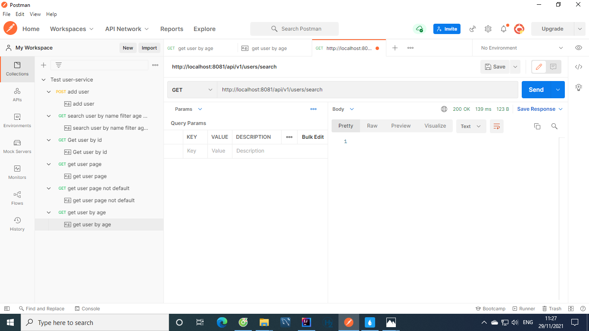
      + Test API bằng Postman với name=to, address=Thanh Hoa
      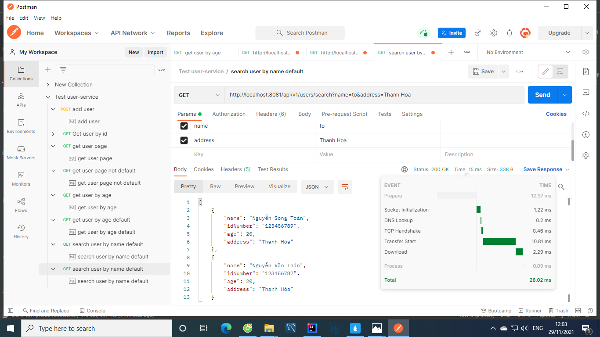
      + Test API bằng Postman với name=to, age=20
      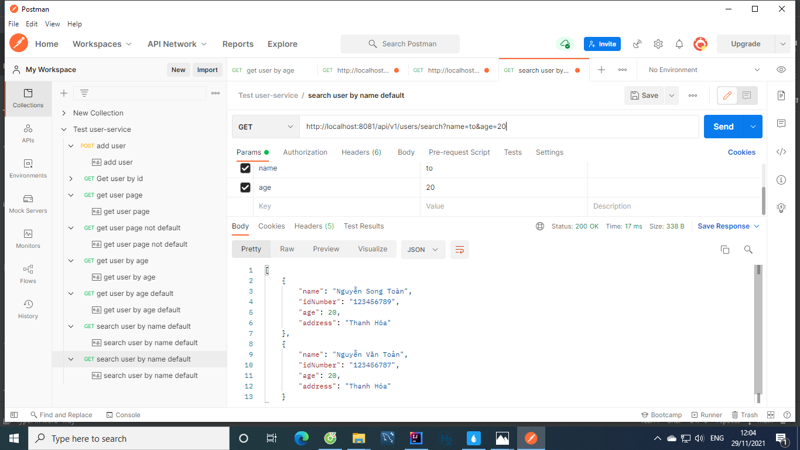
2. POST:
    - createUser:
        + URL: localhost://8081/api/v1/users
        + API nhận đối tượng dưới dạng body và trả về 1 đối tượng cùng HTTP status code 201 sau khi thực hiện thành công
        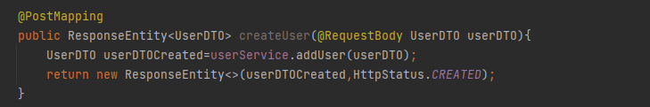
        + Test API bằng postman với đối tượng truyền vào tùy ý:
        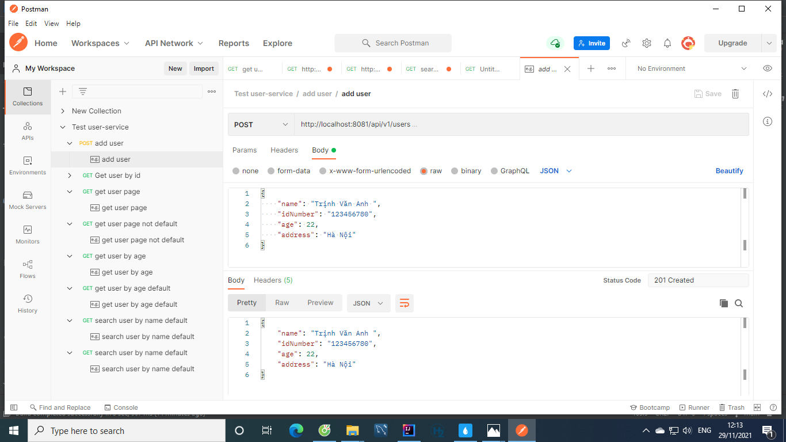

3. PUT:
    - updateUser:
        + URL:localhost://8081/api/v1/users/{id}
         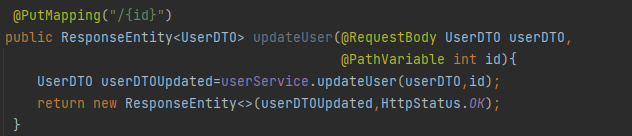
        + API nhận vào 1 đối tượng dưới dạng body và 1 id dưới dạng Path Variable và trả về 1 đối tượng đã được update cùng  HTTP status code 200 sau khi thực hiện thành công
        + Test Test API bằng postman với đối tượng truyền vào tùy ý:
        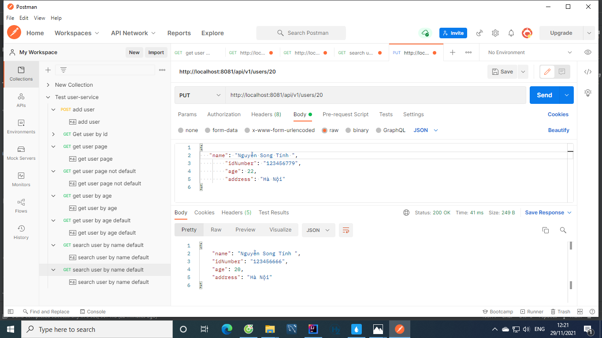
4. PATCH:
    - updateIdNumber
        + URL: localhost://8081/api/v1/users/{id}
        + API nhận vào 1 chuỗi dưới dạng body và 1 id dưới dạng Path Variable và trả về 1 đối tượng đã được update cùng HTTP status code 200 sau khi thực hiện thành công
        
        + Test API bằng postman với tham số tùy ý:
        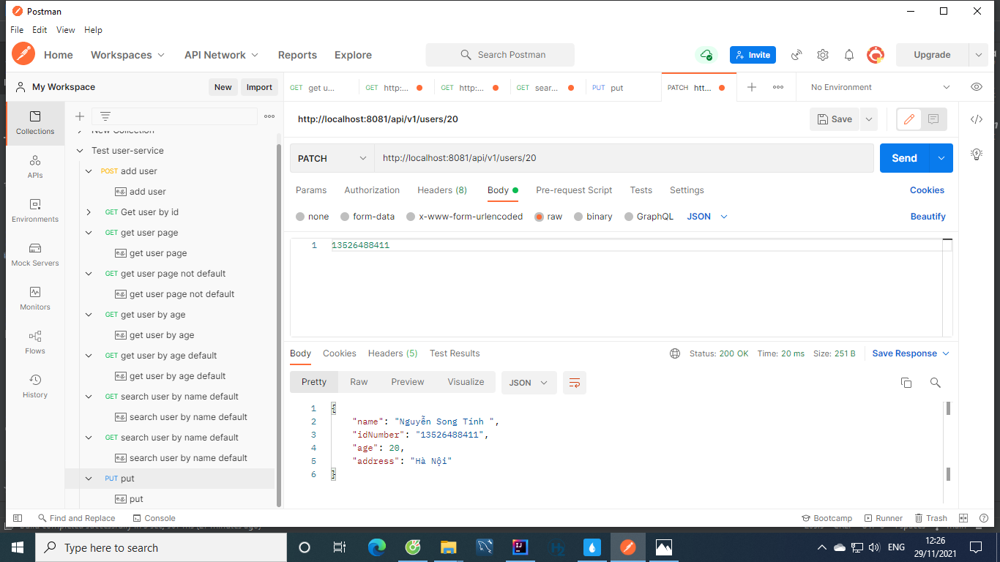
5.Delete:
    - deleteUser:
        + URL: localhost://8081/api/v1/users/{id}
        + API nhận 1 id dưới dạng Path Variable và trả về 1 chuỗi "Deleted User" cùng HTTP status code 200 sau khi thực hiện thành công
        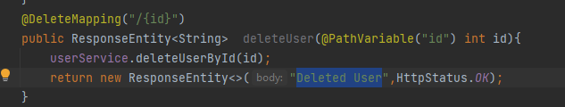
        + Test API bằng postman với tham số tùy ý:
        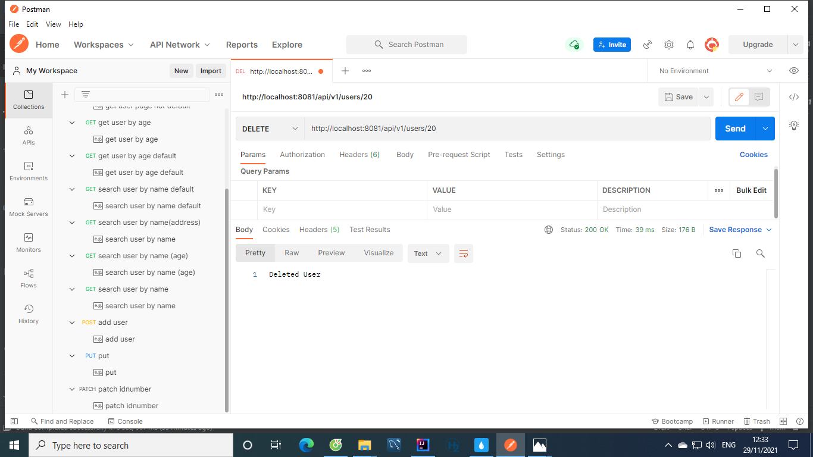
    - deleteUsers:
        + URL: localhost://8081/api/v1/users
        + API trả về 1 chuỗi "Deleted Users" cùng HTTP status code 200 sau khi thực hiện thành công
        + Test API bằng postman:
        + 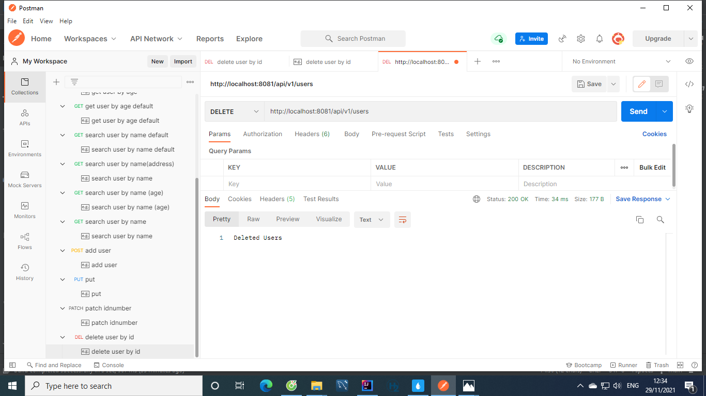
#Chạy project
1. Để chạy project  ta cần thay đổi các trường UserName, password và url cho phù hợp với phiên bản Mysql của mình  tại tệp applocation.properties như hình:
    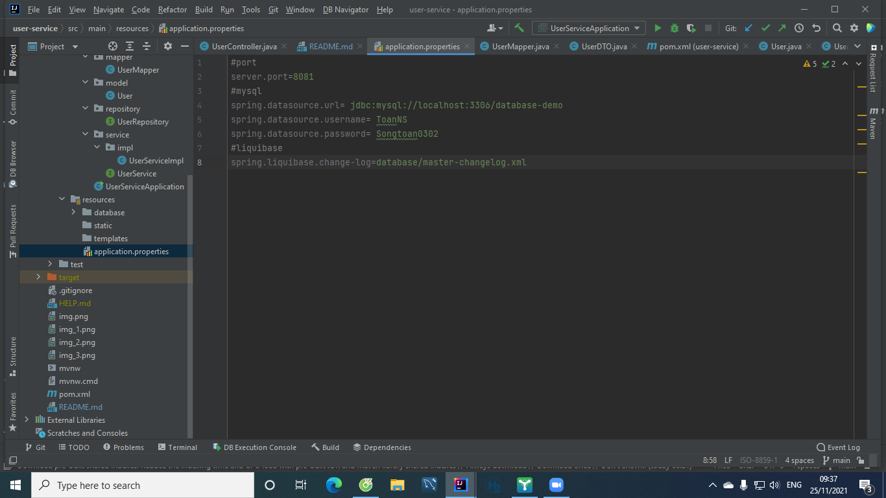
#PostMan Document:https://documenter.getpostman.com/view/16170323/UVJcjw8e

