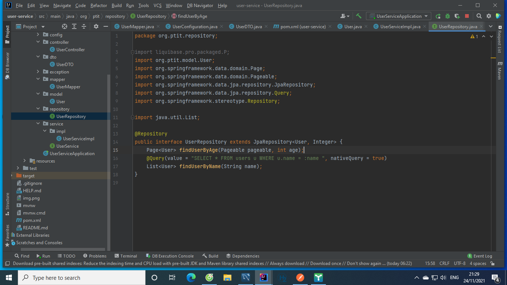
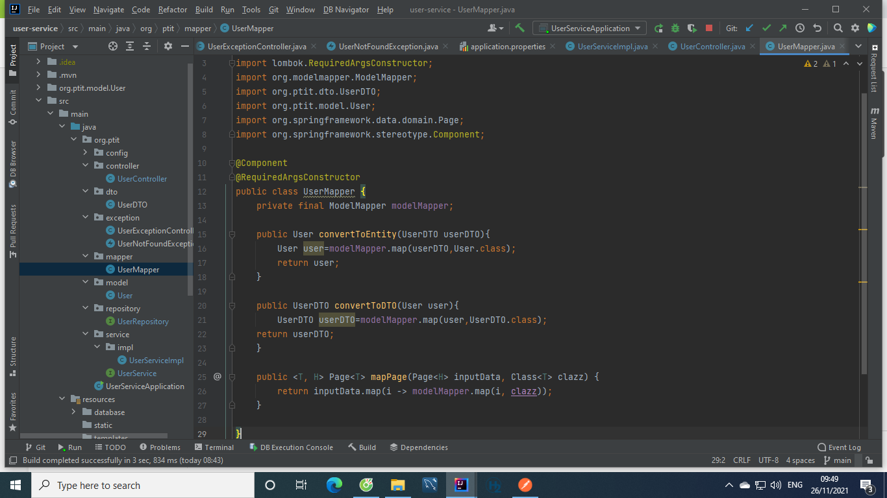
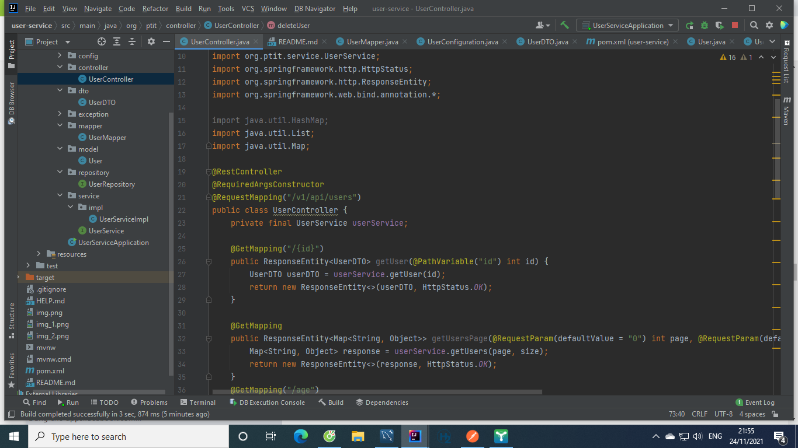
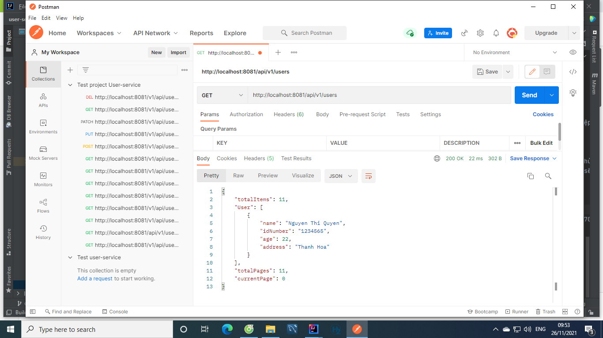

#Tổng quan về project:
1. Trong project này tôi  triển khai Spring Boot với API hỗ trợ thêm,sửa,xóa, phân trang và lọc .
2. Ở đây tôi đang dùng Pageable trong Spring Data Core,Spring Data JPA với cơ sở dữ liệu dựa trên MySQL trong quá trình phát triển 
3. Công nghệ sử dụng:
   - Java 17
   - Spring Boot 2.6.0
   - JPA
   - MySQL
   - LomBok
   - Maven
   - ModelMapper
   - Liquibase
   - IntelliJ Idea for IDE
#Mô tả cụ thể:
1. Project có thực thể User chứa các thuộc tính:
    + id dùng để phân biệt các đối tượng user
    + name để lưu tên user
    + idNumber để lưu cccd của user
    + age để lưu tuổi của user
    + address để lưu địa chỉ ( tên tỉnh) của user
    Nó có dạng như sau:
    
    - Ở đây tôi có dùng thêm các chú thích của Lombok :
      + @Data cung cấp các phương thức getter,setter,constructor bắt buộc,equals,hashcode,toString
      + @AllArgsConstructor,@NoArgsConstructor cung cấp constructor có tất cả các đối, và constructor không đối
    - Ngoài ra còn 1 số chú thích cơ bản như @Entity để đánh dấu class là 1 thự thể ,@Table để xác định tên table , @Id để xác định khóa chính, @GeneratedValue để cấp id tự động và @Column để xác định tên và các tính chất cho cột
2. Kho lưu trữ hỗ trợ phân trang, query data và bộ lọc : 
    
    + Ở đây Repository  cho phép chúng tôi có thể phân trang bằng phương thức findAll mà không cần thực hiện bất kỳ triển khai tùy chỉnh nào và nó phản hồi với Page <T> bao gồm tất cả các giá trị mà tôi cần có trong API của mình.
    + Chúng ta cũng có thể tự định nghĩa phương thức phân trang có bộ lọc như phương thức :
      * `Page<User> findUserByAge(Pageable pageable, int age); `
      * Phương thức này sẽ trả về 1 Page bao gồm tất cả các giá trị mà chúng ta yêu cầu và đã được lọc  theo age 
    + Để xác định SQL thực thi cho một phương thức kho lưu trữ dữ liệu Spring Boot ta dùng @Query. Khi để "nativeQuery = true" ta có thể xác định truy vấn SQL gốc trong thuộc tính giá trị của chú thích .Đọc thêm tại "https://www.baeldung.com/spring-data-jpa-query"
3. Khi thực hiện 1 request nếu dùng lớp User để trả về dữ liệu người dùng thì có trường id sẽ là không cần thiết và trong 1 số trường hợp client mong muốn trả về 1 trường nào đó bất kì ta có thể định nghĩa lớp UserDTO để trả về đúng dữ liệu mà client mong muốn. Làm như vậy ta sẽ tăng được hiệu suất của chương trình và hạn chế dữ liệu dư thừa. Lớp UserDTO :

4. Bằng một cách thông thường khi ta cần mapping dữ liệu ta có thể code thủ công như :
    - `public User convertToEntity(UserDTO userDTO){
      User user1=new User();
      user1.setName(userDTO.getName());
      user1.setIdNumber(userDTO.getIdNumber());
      user1.setAge(userDTO.getAge());
      user1.setAddress(userDTO.getAddress());
      return user1;
      }`
    - Đây là phương pháp thủ công và khi thực thể có nhiều thuộc tính phải thao tác thì sẽ rất mất thời gian . Khi đó ta có thể dùng ModelMapper để làm điều này. Chúng ta chỉ cần :
    - `public User convertToEntity(UserDTO userDTO){
      User user=modelMapper.map(userDTO,User.class);
      return user;
      }`
    - ModelMapper sẽ hỗ trợ cho chúng ta việc chuyển đổi dữ liệu sao cho phù hợp với map().
    - ở đây tôi cũng sử dụng map() để chuyển đổi kiểu dữ liệu của 2 Page:
    - `public <T, H> Page<T> mapPage(Page<H> inputData, Class<T> clazz) {
      return inputData.map(i -> modelMapper.map(i, clazz));
      }
      `
    - Lớp Mapper:
   
    - Note: Chúng ta phải thêm  là @Component để đánh dấu lớp là 1 bean. Làm như vậy lớp sẽ được định nghĩa là 1 bean và sẽ được quản lí trong vùng chứa context
5. Lớp service chứa các chức năng người dùng:
   
    (xem thêm tại UserServiceImpl)
  - Bao gồm các chức năng: 
    + getUser: lấy user theo id và trả về cho lớp Controller
    + addUser: thêm user theo và trả về cho lớp Controller
    + updateUser: sửa thông tin user theo id và trả về cho lớp Controller
    + updateUserByIdNumber: sửa thông tin cccd của user và trả về cho lớp Controller
    + deleteUserById: xóa user theo id
    + deleteUsers: xóa tất cả user
    + getUsers: lấy user và phân trang
    + findUserByAge: lấy user và phân trang có lọc theo tuổi
    + searchUserByName(lọc theo tuổi và theo địa chỉ)
    Các phương thức có chưa phân trang  bao gồm
    + Một  đối tượng  Pageable với page& size.
    + 1 đối tượng Map để lưu list user và các thông số của trang như :currentPage,totalItems,totalPages
    + Các phương thức Page<> đều trả về một  đối tượng Page. Để lấy các thông số ta gọi:
      * getContent() để truy xuất Danh sách các mục trong trang. 
      * getNumber() cho Trang hiện tại. 
      * getTotalElements() cho tổng số mục được lưu trữ trong cơ sở dữ liệu. 
      * getTotalPages() cho tổng số trang.
6. Lớp Service Implement chức năng:

    - Tại đây tôi sẽ triển khai các chức năng của lớp giao diện chúng ta dùng:
        + Phương thức
#Chạy project
1. Để chạy project  ta cần thay đổi các trường UserName, password và url cho phù hợp với phiên bản Mysql của mình  tại tệp applocation.properties như hình:
    
  - Các API nhận request :
    
    + Trong các URL yêu cầu HTTP, các tham số phân trang là tùy chọn. Vì vậy, nếu Rest API  hỗ trợ phân trang phía máy chủ, thì nên cung cấp các giá trị mặc định để phân trang hoạt động ngay cả khi người dùng không chỉ định các tham số này.
    + Đoạn mã trên chấp nhận các thông số phân trang sử dụng @RequestParam chú thích cho page, size. Theo mặc định,user sẽ được tìm nạp từ cơ sở dữ liệu trong chỉ mục trang 0.
    + Tại đây dùng postman để test api theo các url sau:
        * Lấy thông tin 1 user theo id ta dùng: http://localhost:8081/api/v1/users/{id}
        * Lấy thông tin 1 danh sách user có phân trang:
            - Khi không yêu cầu size và page thì 2 tham số sẽ có giá trị mặc định:http://localhost:8081/api/v1/users
          
            - 
  - Link postmam test : https://go.postman.co/workspace/My-Workspace~95693807-e657-4cab-8987-2a4c5af1cd31/collection/16170323-ed5df614-fbf3-42c1-bb3b-3a527c9a9889

