#Tổng quan về project:
1. Project này được xây dựng để triển khai các thao tác cơ bản của client đối với một user bao gồm: thêm ,sửa, sửa cccd của user, xóa user, lấy user, lấy user có phân trang, lấy user theo tuổi có phân trang và tìm kiếm user theo tên ( lọc theo địa chỉ và tuổi)
2. Công nghệ sử dụng:
   - Java 17
   - Spring Boot 2.6.0
   - JPA
   - MySQL
   - LomBok
   - Maven
   - ModelMapper
   - Liquibase
   - IntelliJ Idea for IDE
#Chạy project:
 - URL project: localhost://8081/api/v1/users
1. GET
   - getUser:
        + URL :localhost://8081/api/v1/users/{id}
        + Với API này tham số được truyền vào dưới dạng Path Variable
        + API nhận id trả về user theo id và HTTP status code 200 nếu thành công
        + Test URL bằng Postman với id=20 ta có:
          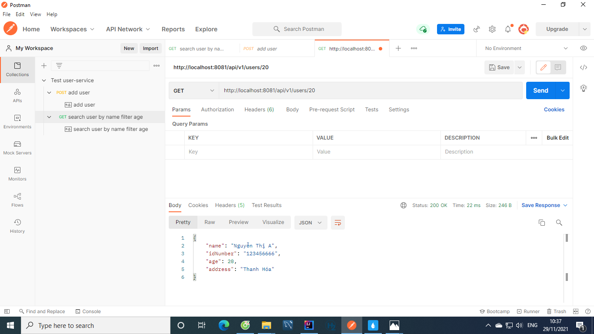
   - listUsers:
        + URL: localhost://8081/api/v1/users
        + API nhận tham số page và size dưới dạng Param và trả về 1 map chứa số lượng user, list user, số trang, số lượng trang theo yêu cầu kèm theo đó là HTTP status code 200 nếu thành công.
        + Nếu không truyền tham số thì tham số sẽ ở dạng mặc định page=0 và size=1
        + Test API bằng Postman với tham số mặc định:
        
        + Test API bằng Postman với tham số tùy ý: Ở đây tôi truyền page=1 and size=10
        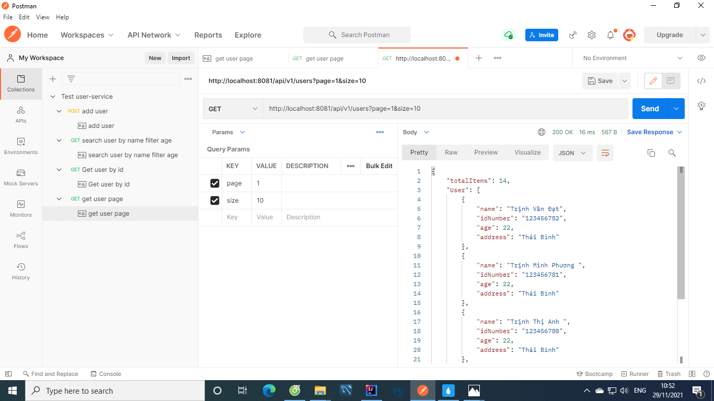
   - findByAge:
        + URL: localhost://8081/api/v1/users/search/age
        + API nhận tham số là page,size và age dưới dạng Param và trả về 1 map chứa số lượng user, list user, số trang, số lượng trang theo yêu cầu kèm theo đó là HTTP status code 200 nếu thành công.Nếu age khác null thì list user được trả về sẽ là list user đã được lọc theo độ tuổi
        + Mặc định page=0,size=1
        + Test API bằng Postman với tham số page=0, size=5,age=19:
        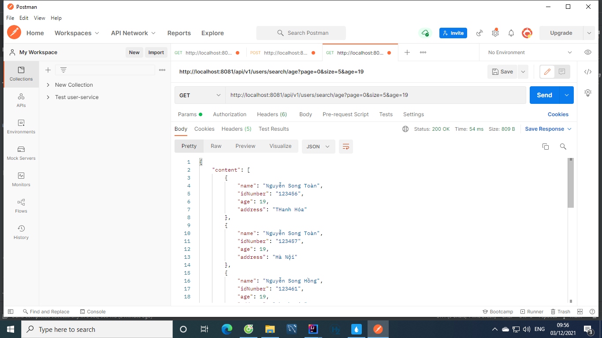
        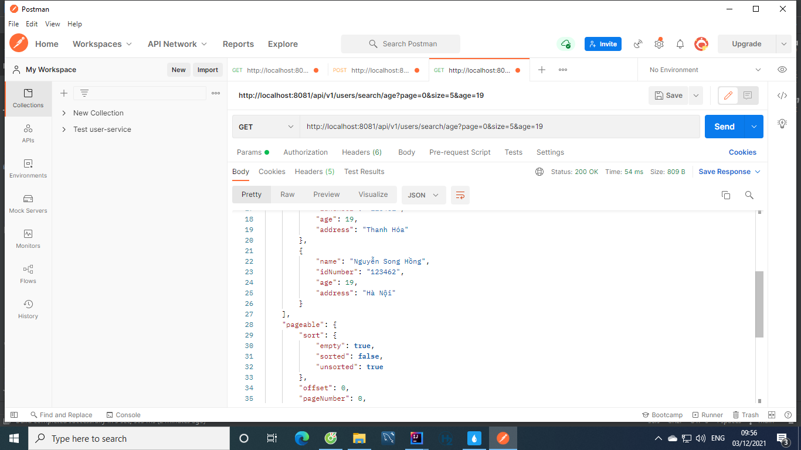
        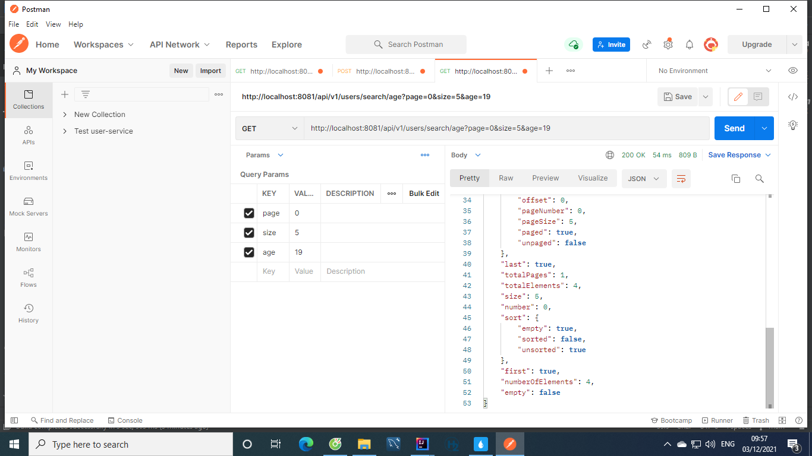
   -  findByNameFilterAddressAndAge:
      + URL: localhost://8081/api/v1/users/search/name
      + API nhận tham số là name, address, age dưới dạng Param và trả về 1 list user theo yêu cầu cùng HTTP status code 200 sau khi thực hiện thành công
      + Mặc định tất cả các tham số đều là null trừ name
      + Test API bằng Postman với name=t, address=Thanh Hoa
     
      + Test API bằng Postman với name=to, age=20
      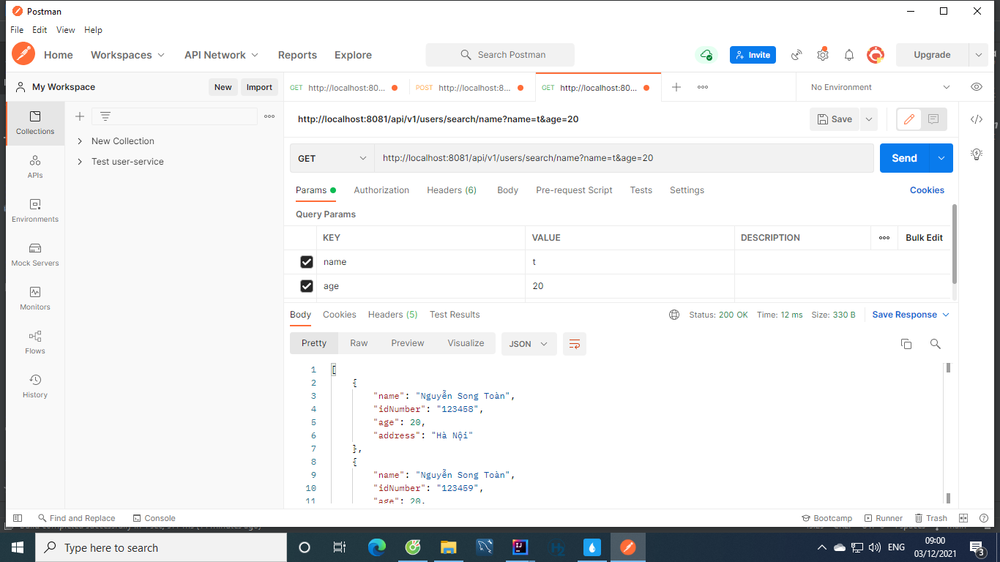
      + Test API bằng Postman với name=t, age=20, address= Ha noi
      +  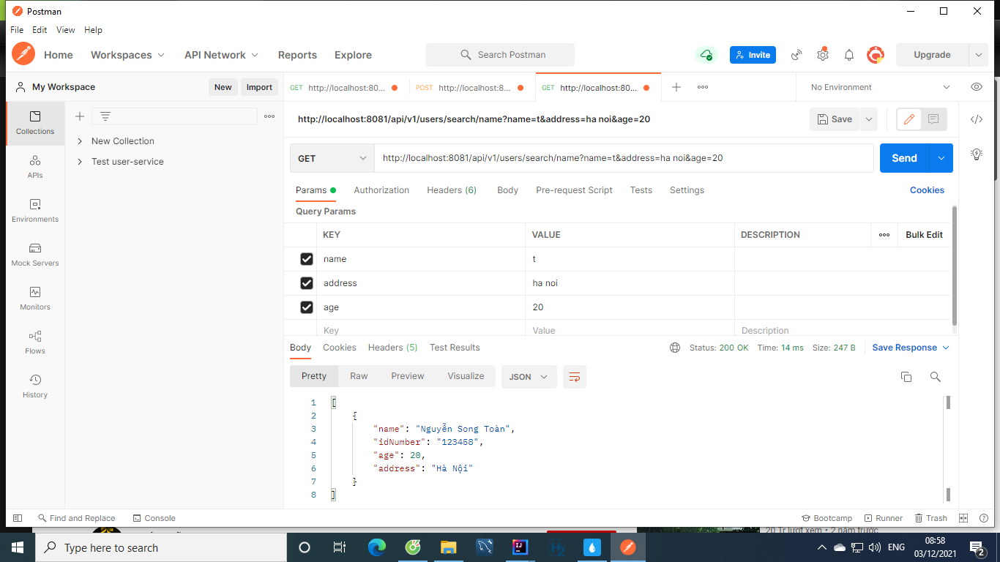
2. POST:
    - createUser:
        + URL: localhost://8081/api/v1/users
        + API nhận đối tượng dưới dạng body và trả về 1 đối tượng cùng HTTP status code 201 sau khi thực hiện thành công
        + Test API bằng postman với đối tượng truyền vào tùy ý:
        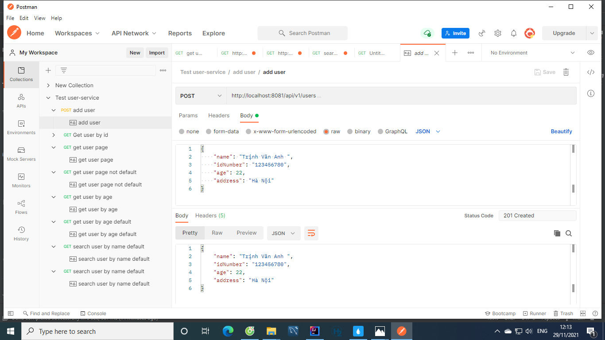

3. PUT:
    - updateUser:
        + URL:localhost://8081/api/v1/users/{id}
        + API nhận vào 1 đối tượng dưới dạng body và 1 id dưới dạng Path Variable và trả về 1 đối tượng đã được update cùng  HTTP status code 200 sau khi thực hiện thành công
        + Test Test API bằng postman với đối tượng truyền vào tùy ý:
        
4. PATCH:
    - updateIdNumber
        + URL: localhost://8081/api/v1/users/{id}
        + API nhận vào 1 chuỗi dưới dạng body và 1 id dưới dạng Path Variable và trả về 1 đối tượng đã được update cùng HTTP status code 200 sau khi thực hiện thành công
        + Test API bằng postman với tham số tùy ý:
        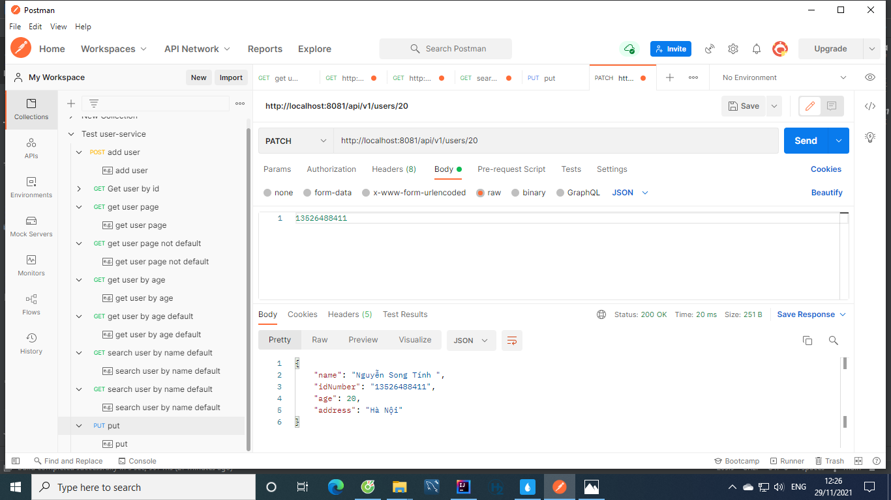
5.Delete:
    - deleteUser:
        + URL: localhost://8081/api/v1/users/{id}
        + API nhận 1 id dưới dạng Path Variable và trả về 1 chuỗi "Deleted User" cùng HTTP status code 200 sau khi thực hiện thành công
        + Test API bằng postman với tham số tùy ý:
        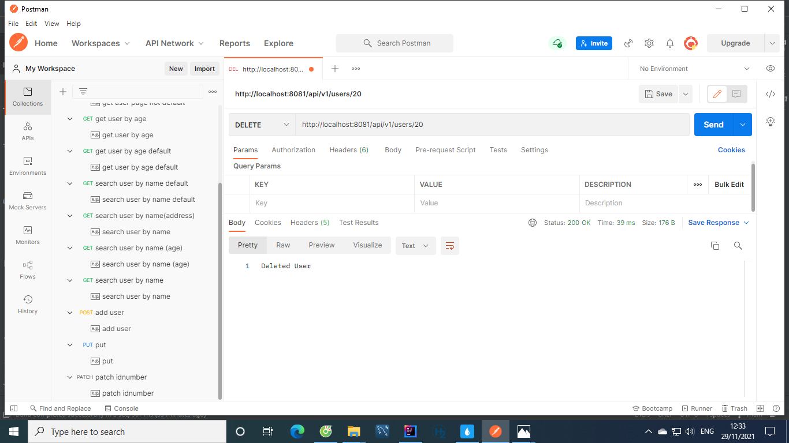
    - deleteUsers:
        + URL: localhost://8081/api/v1/users
        + API trả về 1 chuỗi "Deleted Users" cùng HTTP status code 200 sau khi thực hiện thành công
        + Test API bằng postman:
        + 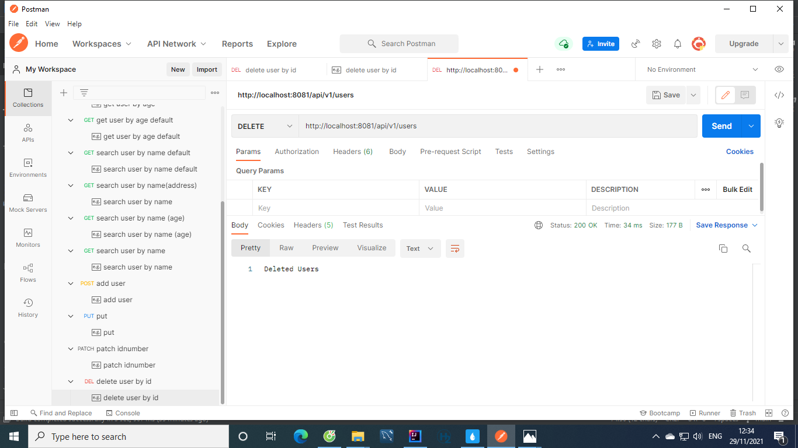
#Chạy project
1. Để chạy project  ta cần thay đổi các trường UserName, password và url cho phù hợp với phiên bản Mysql của mình  tại tệp applocation.properties như hình:
    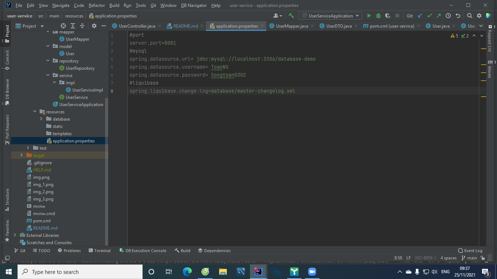
#PostMan Document:https://documenter.getpostman.com/view/16170323/UVJcjw8e

